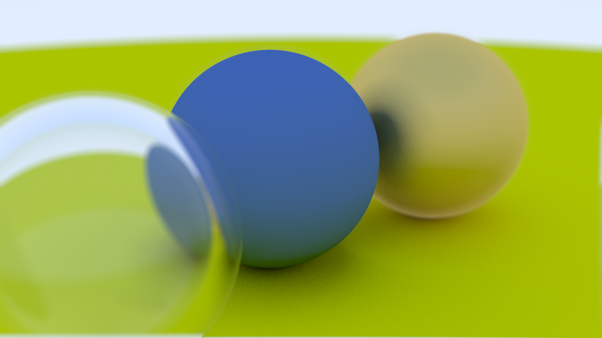

# implementation of the ray tracing in a weekend

This is my implementation of [Ray Tracing in One Weekend](https://raytracing.github.io/books/RayTracingInOneWeekend.html) in Rust.
And then eventually run in the browser with webgpu and spirv using [rust-gpu](https://github.com/EmbarkStudios/rust-gpu).

# current output



# how to run

```bash
cargo run --release
```
